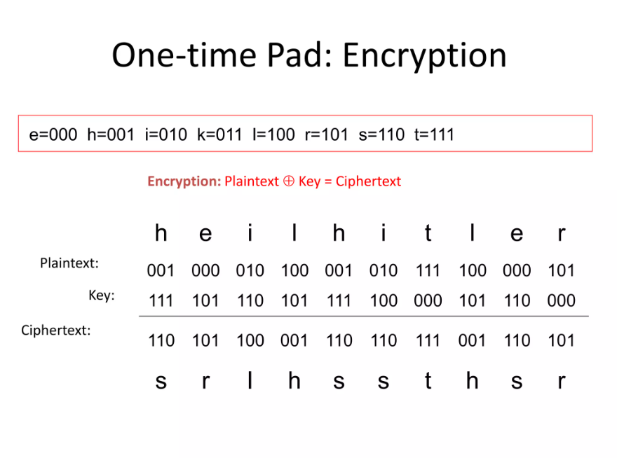

# One Time Pad Cipher

میخوایم الگوریتم رمز نگاری One Time Pad Cipher رو پیاده سازی کنیم.

این الگوریتم اینطوری کارمیکنه که شما هر کاراکتر رو به یک عدد نسبت میدین و سپس اون عدد رو با یک کلید دیگه، ترکیب میکنید و از عملیات های ریاضی به هر نحوی استفاده میکنید تا اون رو بتونید ایجاد کنید.

سپس از این کلید ها و عدد اولیه که برای رمزنگاری هر کاراکتر استفاده کردید، استفاده میکنید و اون رو به شکل اولیه در میارید.
 
برای درک بهتر تصویر زیر رو بررسی کنید:

